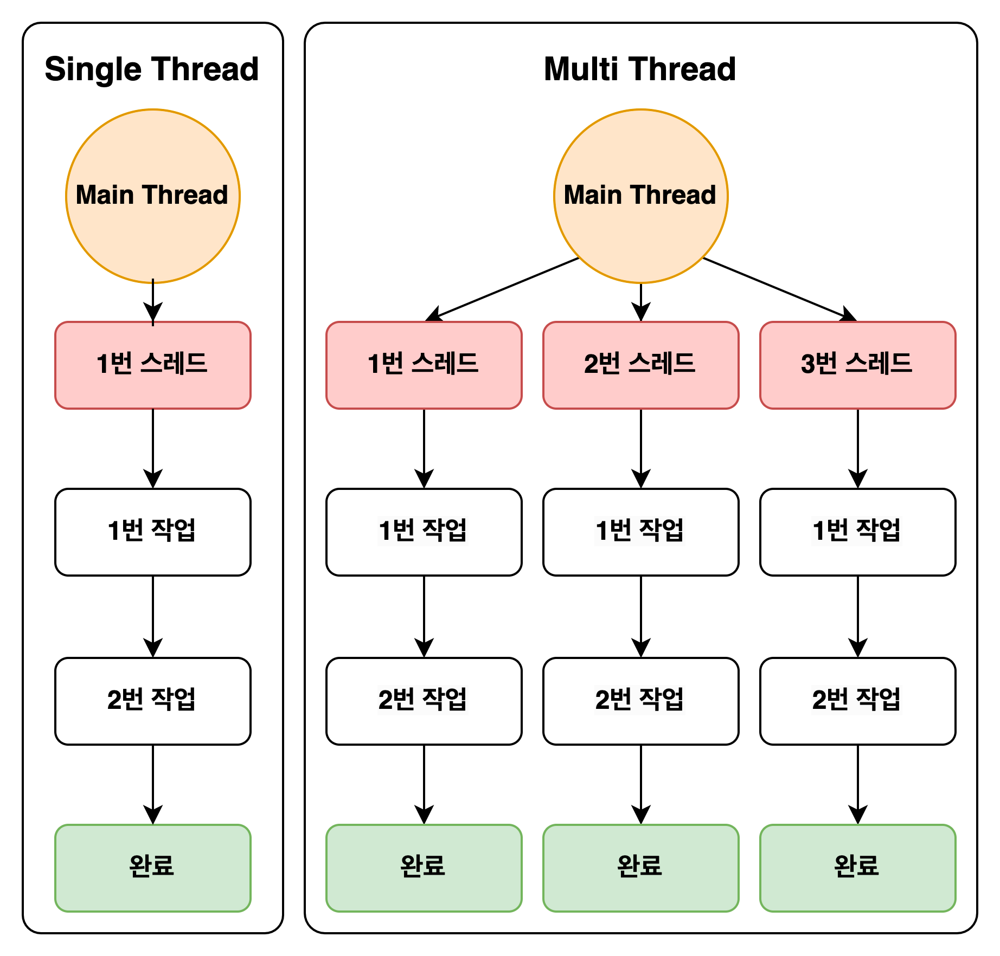

스레드에 관련하여 너무나도 잘 작성된 게시물이 많이 때문에 스레드에 역할과 분석에 대해서는 아래 참조 게시물을 보는게 가장 좋을 거 같습니다.
그 와중에 눈에 유독 들어오게되는 게시물이 있는데 이 게시물에 대해 좀 더 깊에 파고 들어가 볼 생각입니다.

1. 스레드는 많으면 많을수록 좋을까?
2. 

Reference
https://inpa.tistory.com/entry/%F0%9F%91%A9%E2%80%8D%F0%9F%92%BB-Is-more-threads-always-better