# 포트폴리오 슬라이드

---

## Slide 01 | 표지 / 자기소개

이름: 박중현
포지션: Backend Engineer
소속: Dktechin a kakaocompany (현재)
경력: 6년차 (2020 ~)

> 고객 상담 시스템(CS)의 백엔드 개발과 통계 데이터 정합성 운영을 담당하며, 운영 리스크를 최소화하는 서비스 구조 설계를 주도해 왔습니다.

연락처: kos5667@gmail.com
GitHub: https://github.com/kos5667

### 커리어 여정

```
2020.01 ── 재하정보기술 ───────────────── 2022.06
               K-GeoPlatform 1차 / 2차
               공간정보 / 공공행정 도메인

2022.07 ── Dktechin ──────────────────────── 현재
               │
               ├─ Phase 1 (2022.07 ~ 2022.12)
               │    통계 운영 기반 구축
               │
               ├─ Phase 2 (2023.01 ~ 2024.06)
               │    서비스 개편 / CRMS-API 분리
               │
               └─ Phase 3 (2024.07 ~ 현재)
                    플랫폼 고도화 / 보안 강화 / Multi IDC
```

### 핵심 도메인 변화

- 공간정보 / 공공 행정 (재하정보기술)
- 대규모 CS 플랫폼 / 실시간 메시징 / 통계 (Dktechin)

### 공통 역량

- Java, Spring Boot 기반 백엔드 개발
- RDBMS 설계 및 쿼리 최적화
- 서비스 운영 중 이슈 개선

---

# 🧑🏻‍💻 Projects

## Slide 01 | 카카오 CS 플랫폼 개요 - 대규모 실시간 상담 시스템

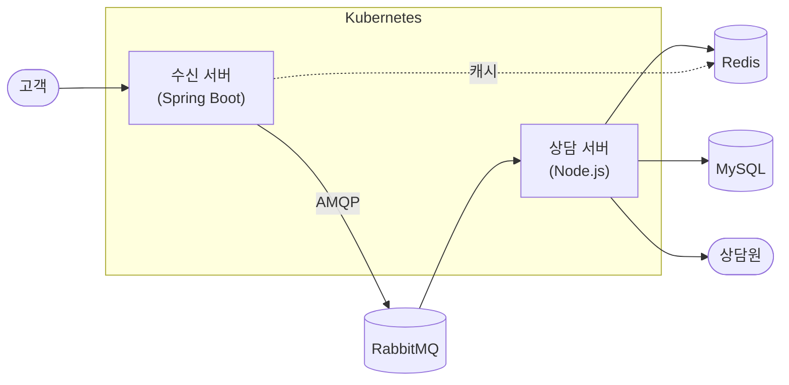

### 서비스 소개

카카오 전사 고객 상담을 처리하는 실시간 상담톡 플랫폼 전담 운영.
고가용성과 무중단 운영이 핵심 요구사항인 환경에서 안정성과 확장성을 지속 개선했습니다.

### 담당 범위

- Spring Boot 3.4 / Java 21 기반 수신 서버 설계 및 운영
- RabbitMQ 기반 수신 서버-상담 서버 간 메시지 전달 구조 운영
- Kubernetes 인프라 전반 (배포 구조, CI/CD, HPA)
- Node.js 기반 실시간 상담 서버 운영 (실시간 메시징, 상담 배분, 실시간 통계)
- Multi IDC 고가용성 구조 설계

### 기술 스택

Spring Boot 3.4 / Java 21, MySQL, Redis, RabbitMQ, Kubernetes, Bucket4j, Vault,
Node.js / TypeScript / Express / Socket.io, Vue3

기간: 2022.07 ~ 현재 | 단독 운영 | 기여도 100%

---

## Slide 02 | Multi IDC 고가용성 아키텍처 설계

Before

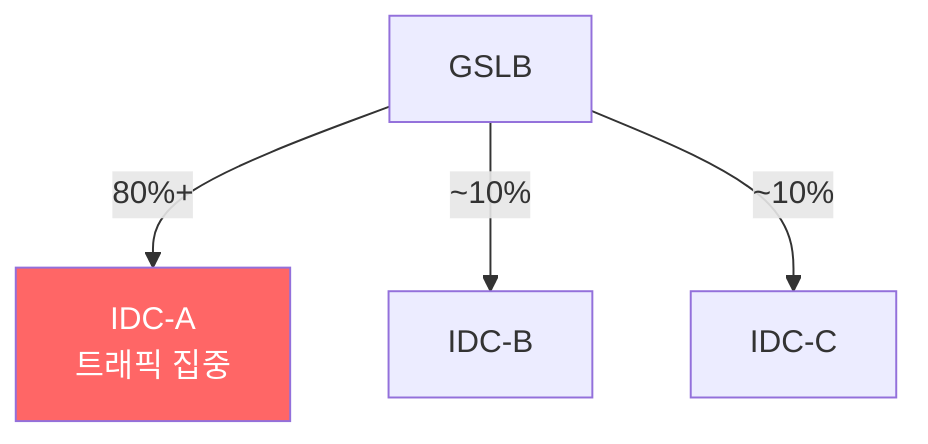

After

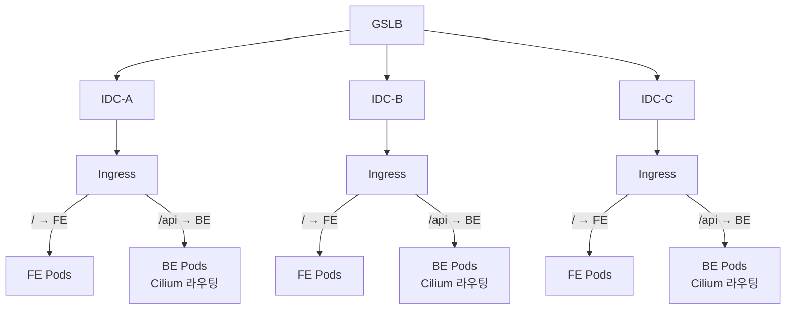

### 배경

Multi IDC 도입 후 IDC-A에 트래픽 80% 이상이 편중되는 문제 발생.
운영 안정성과 장애 대응력이 저하될 수 있는 상황.

### 원인 분석

GSLB 분배 정책에는 두 가지 방식이 있음.

- A (균등 분배): 트래픽을 모든 리전에 동일 비율로 분산 → 정상 동작
- B (가중 분배): 한 리전에 집중적으로 트래픽을 보낸 뒤 일정 구간 후 다른 리전으로 전환

B 정책 적용 구간에서 IDC-A로 트래픽이 집중되고, DNS 캐싱으로 인해
정책 전환 후에도 클라이언트가 IDC-A로 계속 라우팅되는 현상 지속.

GSLB A정책으로 전환하면 해소되지만, 운영에서 검증되지 않은 정책 변경은 리스크가 컸습니다.
클러스터 내부에서 처리 가능하다고 판단해 Kubernetes 레벨에서 트래픽을 재분산하는 방향을 선택했습니다.

### 해결 방식

DNS 캐싱 우회를 위해 GSLB 레벨이 아닌 Kubernetes 클러스터 내부에서 트래픽을 재분산.

- Ingress에 경로 기반 라우팅 추가: `/`는 Client Service(FE), `/api` `/tools`는 Server Service(BE)로 분리
- Service 객체는 라우팅 규칙을 정의해 etcd에 저장하고, Control Plane이 이를 각 Node에 전파
- 실제 트래픽 전달은 각 Node의 Cilium이 담당: Service 규칙에 따라 적절한 Pod IP로 전달
- Cilium VXLAN 터널링으로 Node 간 Pod 라우팅을 투명하게 처리

### 결과

- Multi IDC 환경 무중단 운영 구조 확보
- 트래픽 급증 시에도 수평 확장 가능한 기반 마련
- 장애 발생 시 IDC 단위 격리 및 대응 체계 확보

---

## Slide 03 | 상담톡 아키텍처 현대화 - 운영 중단 없는 레거시 개선 전략

### 배경

- 장기 운영으로 누적된 의존성 과다 단일 파일 하나의 코드 라인도 3,000줄 이상, 메서드 50개 이상으로 비대해진 구조에서 기능 하나를 수정할 때 영향 범위 파악이 어렵고 온보딩 비용도 높은 상황.
- 운영 중인 서비스를 중단 없이 개선해야 하는 제약

### Before - 기술 중심 패키지 구조

```
src/
├── controllers/    ← 비즈니스 로직이 컨트롤러에 혼재
├── models/         ← I/O 모델, 도메인, 캐시가 같은 파일에 공존
├── services/       ← 도메인 로직 없이 유스케이스 처리 집합소
└── routes/
```

### After - 도메인 중심 구조

```
src/
├── domains/
│   └── agent/
│       ├── AgentEntity        ← 도메인 엔티티
│       ├── AgentRepository    ← 도메인 저장소 인터페이스 (추상화)
│       └── AgentEvents        ← 도메인 이벤트 정의
├── application/
│   └── agent/
│       └── AgentApplicationService  ← 유스케이스 처리(트랜잭션 단위)
├── infrastructure/
│   └── repository/
│       ├── persistence/       ← ORM 기반 저장소 구현
│       └── caching/           ← Redis 기반 캐시 구현
├── interfaces/                ← 입출력 인터페이스 모음
│   └── AgentController        ← HTTP 핸들러
└── routes/
    ├── HttpRouter             ← RESTful HTTP 요청 라우팅
    ├── GrpcRouter             ← gRPC 프로토콜 라우팅
    └── SocketRouter           ← 실시간 Socket 이벤트 라우팅
```

### 전략: Strangler Fig 점진 이관

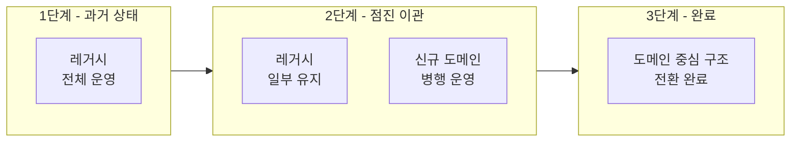

- 변경 영향이 작은 영역부터 순차적으로 리팩토링, 운영 리스크 통제
- 도메인 경계를 명확히 하고 인터페이스 기반으로 의존 역전 원칙 적용
- 테스트 커버리지를 핵심 플로우 중심으로 먼저 확보한 뒤 리팩토링 범위 확장

### 결과

- 구조 정리로 변경 영향 범위 축소, 유지보수성 개선
- 회귀 리스크 감소로 배포 안정성 향상
- 온보딩 비용 대폭 절감

---

## Slide 04 | 분산 환경 안정성 확보 - Rate Limiting & 분산락

Rate Limiting

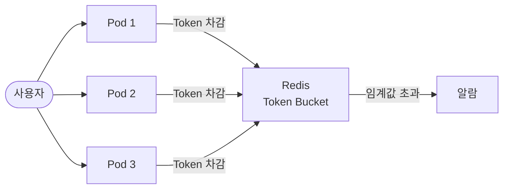

분산락

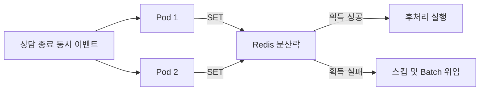

### 문제 1. 어뷰징 감지 - 다중 Pod 환경에서 사용자별 요청 제어

- Kubernetes Pod 간 상태를 공유하지 않아 개별 Pod 단위 Rate Limit으로는 어뷰징 감지 불가
- Redis + Bucket4j Token Bucket 알고리즘으로 분산 상태 공유 기반 Rate Limiting 구현
- 차단 대신 알람 정책 채택으로 정상 사용자 오차단 0건

### 문제 2. 후처리 중복 실행 - 다중 Pod 동시 실행 제어

- 상담 종료 이벤트를 여러 Pod가 동시에 수신해 후처리 로직이 중복 실행되는 문제
- Redis 분산락 (SET NX PX) 으로 동일 채팅방 후처리 동시 실행 제어
- 멱등성 보장으로 운영 이슈 제거

### 문제 3. 카테고리 트리 탐색 - 재귀 구조의 스택 오버플로우 리스크

- 카테고리 뎁스 증가에 따라 재귀 탐색의 스택 오버플로우 위험과 성능 저하가 누적되는 문제
- 재귀 탐색을 BFS로 전환해 뎁스와 무관한 안정적 탐색 구조 확보
- 초기화 시간은 동일하지만 뎁스 탐색 시간 초 단위 → ms 단위 단축

### 공통 설계 원칙

정상 사용자에게 영향을 주지 않으면서 비정상 케이스만 격리.

---

## Slide 05 | 배포 구조 개선 - 단위 분리와 무중단 운영

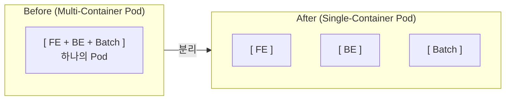

### 배경

단일 Region으로 운영하던 시절 데이터센터 화재로 장시간 운영 장애 발생.
운영 리스크를 줄이고자 Multi IDC를 도입했고, 이에 맞춰 Container 분리 작업을 병행해
리소스 배분 최적화와 장애 대응 속도 향상을 함께 도모했습니다.

### Before

- FE / BE / Batch가 하나의 Multi-Container Pod로 묶여 있어 하나만 변경해도 전체 재빌드
- FE 변경 하나에도 BE 이미지를 함께 빌드하고 Pod 전체를 교체
- 배포 단위가 크고 롤백 범위가 넓어 핫픽스 대응 속도 저하

### After

- FE / BE / Batch를 Single-Container Pod로 분리해 독립 배포 구조로 전환
- 카나리 / 블루그린 배포 전략 적용 가능한 구조 확보
- 상담톡 K8s 구성 변경 적용
- 서비스별 적절한 리소스 분배를 위한 정책 확립

### 수치 비교

|  | Build | Deploy | Resource |
|---|---|---|---|
| Before | FE 5~8분, BE 5~8분 | FE 3~5분, BE 3~5분 | FE 8개, BE 8개 |
| After | FE 1분, BE 2~3분 | FE 1분, BE 2~3분 | FE 2개, BE 8개 유지 |

### 효과

- 핫픽스 및 장애 대응 리드타임 감소
- FE 리소스 8개 → 2개로 축소, 불필요한 자원 낭비 제거
- 서비스별 독립 모니터링 및 스케일링 가능
- 배포 구조 개선 - 카나리 / 블루그린 배포 기반 확보(리소스 부족으로 검증만 진행)

---

## Slide 06 | 보안 강화 - Vault & AES-GCM 암호화 체계

### 수행 내용

- Vault 기반 키 관리 체계 도입: 서비스별 시크릿 중앙 관리, 런타임 주입
- AES-GCM 암호화 적용: 서버 간 인증 및 민감정보 보호 모듈 구현
- 소스 내 Secret(계정정보, 암호화 키, 메시지, 개인정보등) 평문 노출 제거
- Spring Security 6 기반 세션 보안 설정 강화
- ISMS-P 인증 대응: 보안 점검 및 취약점 개선

### 설계 원칙

- 시크릿은 코드에 포함하지 않고 Vault에서 런타임에 주입
- 서비스 간 통신에 암호화 기반 인증 적용

### 결과

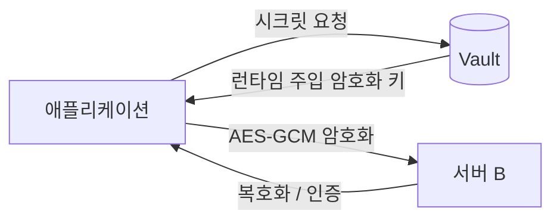

- 민감정보 노출 리스크 제거(Redis, DB 암호화 보관)
- 보안 감사 및 인증 대응 기반 확보

---

## Slide 07 | 통계 데이터 정합성 - 운영 판단 오류 리스크 제거

### 배경

카카오 고객센터 운영자가 매일 사용하는 통계 조회 / 배치 / Excel 출력 서비스.
수치 불일치 이슈가 반복되며 운영자 의사결정의 신뢰성 저하.

### 문제

- 그룹별 실적 / 상담원 현황 / 주간 집계 수치가 맞지 않는 케이스 반복 발생
- 특정 일자 누락 데이터, 장기 미처리 문의 집계 오류

### 접근 방식

- 조회 SQL과 배치 SQL 결과를 항목별로 대조해 수치가 갈라지는 구간 특정
- 특정 일자 범위에서 집계 배치가 스킵되는 패턴 확인, 누락 데이터 복구 로직 추가
- 배치 파이프라인에 보정 처리 단계를 삽입해 재발 방지

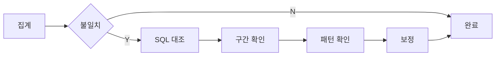

### 결과

- 수치 불일치 반복 이슈 제거
- 신뢰 불가 데이터로 인한 운영 판단 오류 리스크 제거
- 운영 데이터 신뢰도 확보

---

## Slide 08 | CRMS, CRMS 통계 서비스 현대화 - 마이그레이션 / 구조 분리

### 배경

CRMS 통계 서비스가 EOL 임박한 레거시 환경에서 운영 중.
CRMS는 API 기능 혼재로 변경 영향 범위도 계속 확대되는 상황.

### CRMS 통계 프레임워크 마이그레이션 (단독 수행)

- javax → jakarta 네임스페이스 전환 (전 레이어)
- Spring Security 6 대응: WebSecurityConfigurerAdapter 제거, 람다 기반 DSL로 재작성
- RestTemplate → WebClient 전환 및 외부 연동 재정비
- Openstack 기반 VM → Kubernetes 배포 전환: Dockerfile / Vault 설정 / Kustomize 오버레이 정비
- ShedLock 기반 분산 배치 락 적용

### CRMS API 서버 분리 (2023.11 ~ 2024.07 | 구성: 4명 | 기여도 30%)

- RESTful 기반 CRMS-API 전담 서버를 신규 설계 및 점진 이관
- Springdoc OpenAPI 기반 API 문서화 및 표준 응답 규격 / 공통 Exception Handler 정비
- ACL 강화, CORS 정책 재정의

### 결과

- EOL 프레임워크 위험 해소 및 보안 취약점 대응 기반 마련
- API 서버 독립 배포로 변경 영향 범위 축소, CRMS 본 시스템 부하 분산

| 항목 | Before | After |
|---|---|---|
| 런타임 환경 | VM 기반 | Kubernetes (DKOS) |
| 프레임워크 | Spring Boot (EOL) | Spring Boot 3.5 / Java 21 |
| 네임스페이스 | javax | jakarta |
| Security 설정 | WebSecurityConfigurerAdapter | 람다 기반 DSL |
| HTTP 클라이언트 | RestTemplate | WebClient |
| API 구조 | CRMS 단일 서버 혼재 | CRMS-API 분리 서버 |
| 시크릿 관리 | 소스 내 평문 | Vault 런타임 주입 |

---

## Slide 09 | K-GeoPlatform - ETL 파이프라인 & 대용량 데이터 처리

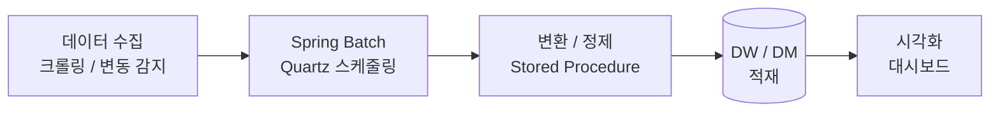

### 프로젝트 개요

국토교통부 K-GeoPlatform 1, 2차 구축 사업 참여.
공간정보 데이터 통합 관리 및 부동산/행정 도메인 서비스 개발.

기간: 2020.06 ~ 2022.04 | 재하정보기술

### 주요 문제 해결

- 대용량 Join 병목: 17개 시도 코드별 테이블 반복 Join을 파티션 구조 개선으로 해소
- ETL 자동화: Spring Batch + Quartz 기반 데이터 변동 처리 파이프라인 설계/구축
- 공간 데이터 처리: PostGIS 공간 쿼리 기반 좌표 추출 및 위치 정확도 향상
- 다중 RDBMS 운영: Oracle / PostgreSQL / Tibero Migration 및 DW/DM 구축

### 기술 스택

Java, Spring Boot, Spring Batch, Quartz, MyBatis, PostgreSQL, PostGIS, Oracle, Tibero

---

# ☑️ Side Projects

## Slide 01 | Compression Cache Library

Spring Boot 환경에서 Redis 캐시 값을 압축 저장하고, 데이터 크기에 따라 Caffeine과 Redis를 분기하는 캐시 라이브러리.

기술 스택: Kotlin, Spring Boot 3, Spring Cache, Spring Data Redis, Caffeine, Jackson, Gzip, LZ4, Snappy, Gradle, Java 21

---

### 프로젝트 개요

Spring Cache는 적용이 간단하지만, 캐시 데이터 크기가 커질수록 메모리 사용량과 네트워크 비용이 증가합니다. 작은 데이터까지 모두 Redis로 보내면 응답 경로가 길어지고, 로컬 캐시만 쓰면 인스턴스 간 공유가 어렵습니다. 데이터 크기를 기준으로 Caffeine과 Redis를 분기하고, 큰 데이터는 압축해 저장하는 구조를 실험했습니다.

---

### 핵심 흐름

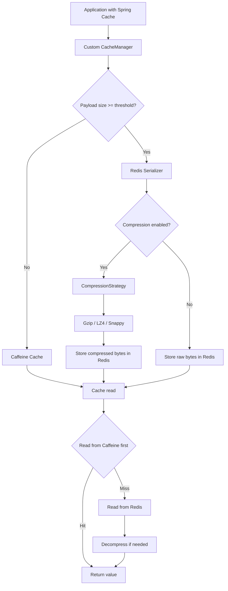

CacheManager를 감싸 기존 Spring Cache 사용 방식을 유지했습니다.
Redis 직렬화 지점에서 압축 여부를 결정해 애플리케이션 코드가 압축 로직을 알지 않도록 분리했습니다.

---

### 기술적 고민

1. 압축 로직을 서비스 코드에서 분리하는 문제

   CacheManager와 RedisSerializer를 커스터마이징해 Spring Cache 추상화 아래에서 동작하도록 했습니다.
   애플리케이션은 기존처럼 @Cacheable을 사용하고, 압축과 역직렬화는 라이브러리 내부에서 처리합니다.
   압축 기능이 서비스 로직이 아닌 인프라 계층에 머무르도록 분리한 점이 핵심이었습니다.

2. 타입 안전한 역직렬화

   직렬화 시 클래스 이름과 데이터 바이트를 함께 저장하고, 역직렬화 시 클래스 정보를 읽어 원래 객체로 복원했습니다.
   다만 클래스명 문자열에 의존하는 방식은 장기적으로 더 안전한 스키마 설계가 필요하다는 한계도 확인했습니다.

3. 저장 위치 분기 - Dual Cache 구조

   임계값 이하는 Caffeine, 초과는 Redis로 분기하고, 압축도 임계값 이상일 때만 적용했습니다.
   "압축 여부"보다 "어디에 저장할 것인가"가 더 중요한 설계 포인트라는 점을 이 과정에서 정리할 수 있었습니다.

4. 압축 알고리즘 교체 가능 구조

   CompressionStrategy 인터페이스로 추상화하고 Gzip, LZ4, Snappy 구현체를 분리했습니다.
   설정값으로 알고리즘을 교체할 수 있게 해 비교 실험 비용을 낮췄습니다.

---

### 회고

캐시 최적화는 압축 알고리즘 선택만의 문제가 아니었습니다.
데이터 크기, 저장 위치, 직렬화 방식, 복원 안정성을 함께 다뤄야 실제로 의미 있는 구조가 됩니다.

Spring 추상화를 활용하되 필요한 지점만 확장하는 방식이 구현 속도와 학습 효율 면에서 효과적이었습니다.

다음에 보완할 것:
- Gzip, LZ4, Snappy 압축률과 CPU 비용을 비교하는 실제 벤치마크 추가
- 직렬화 안정성과 캐시 히트 경로를 검증하는 테스트 보강 (현재 비활성화)
- 타입 복원 방식을 클래스명 문자열에서 명시적인 메타데이터 구조로 개선

---

## Slide 02 | 커머스 백엔드 API 서버 구축

기술 스택: Java 21, Spring Boot 3.5, Spring Data JPA, MySQL 8.4, Flyway, Docker Compose, Testcontainers, Gradle

---

### 프로젝트 개요

사용자, 상품, 주문 도메인을 가진 커머스 API 서버입니다.
단순 CRUD보다 주문 처리의 정합성과 동시성 제어를 중심으로 구현했습니다.

구현 범위:
- 사용자 등록, 잔액 조회, 잔액 충전 API
- 상품 등록, 목록 조회, 상세 조회, 재고 입고 API
- 단건 및 다건 주문 API
- 주문 시점의 상품명, 가격, 수량 스냅샷 저장
- 주문 실패 이력 저장
- 동시 요청 상황을 검증하는 통합 테스트 구축

---

### 핵심 흐름

주문에서 사용자와 상품에 대한 락 순서 고정, 주문 스냅샷 저장, 실패 주문의 별도 트랜잭션 기록이 핵심입니다.

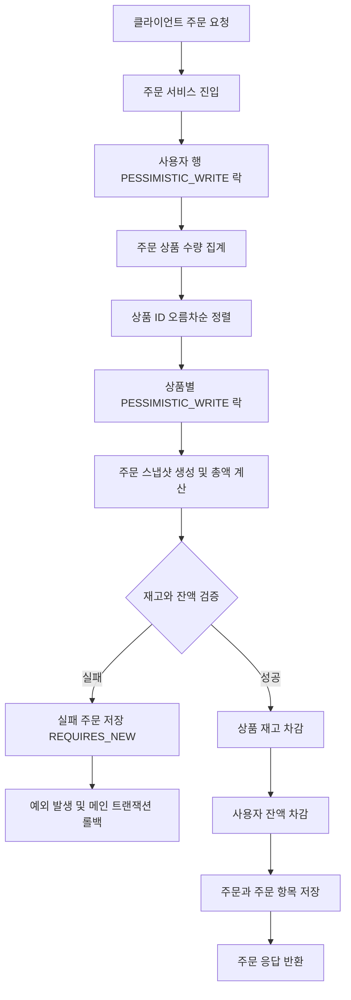

---

### 기술적 고민

1. 동시 주문의 정합성 - 비관적 락과 락 순서 고정

   동시 주문이 들어오면 잔액 차감이나 재고 차감에서 정합성이 깨질 수 있었습니다.
   사용자 충전, 상품 입고, 주문 처리에 JPA 비관적 락을 적용했습니다.
   주문에서는 사용자 먼저, 상품은 ID 오름차순으로 락 순서를 고정해 교착 상태를 방지했습니다.
   동시 주문 테스트에서 허용 가능한 요청만 성공했고, 잔액과 재고가 기대값과 일치했습니다.

2. 동일 상품 중복 주문 처리 - 집계 후 검증

   한 주문에 동일 상품이 여러 번 들어오면 중복 계산과 재고 차감 로직이 복잡해질 수 있었습니다.
   주문 요청을 상품 ID 기준으로 먼저 집계한 뒤, 집계된 수량만 기준으로 총액 계산과 재고 검증을 수행했습니다.
   요청 포맷은 유연하게 유지하면서도 내부 처리 로직은 단순해졌습니다.
   주문 시점의 상품명, 가격, 수량을 스냅샷으로 저장해 이후 상품 정보가 바뀌어도 주문 이력이 당시 상태를 보존합니다.

3. 실패 주문 이력 - REQUIRES_NEW 트랜잭션 분리

   메인 주문 트랜잭션 안에서 실패 주문을 저장하면 예외 발생 시 함께 롤백되는 문제가 있었습니다.
   실패 주문 저장 로직을 별도 컴포넌트로 분리하고 REQUIRES_NEW 트랜잭션으로 처리했습니다.
   성공 주문은 원자적으로 처리하고, 실패 주문은 롤백과 무관하게 기록할 수 있었습니다.
   재고 부족과 잔액 부족 상황을 사후 분석할 수 있는 구조가 됐습니다.

4. 환경 분리 - 프로필, Flyway, Testcontainers

   로컬, 테스트, 운영 환경의 설정을 한 곳에 섞어두면 배포와 검증 기준이 불명확해질 수 있었습니다.
   local, test, prod 프로필을 분리하고, 운영 스키마는 Flyway 마이그레이션으로 관리했습니다.
   테스트는 Testcontainers 기반으로 실제 MySQL 환경에 가깝게 구성했습니다.
   개발 환경 편의성과 운영 환경 일관성을 분리할 수 있었고, 테스트 신뢰도도 높일 수 있었습니다.

---

# 🙋🏻 How i work

### 개선 과제를 스스로 찾습니다

이슈가 들어오기를 기다리기보다, 서비스와 코드를 직접 관찰하며
잠재적인 리스크와 개선 포인트를 먼저 파악합니다.
방향을 고민하고 설계해 실행으로 이어지는 방식으로 일합니다.

### 구현보다 원인을 먼저 봅니다

복잡한 구현이 필요한 문제보다, 현상의 원인을 명확히 파악하고
현재 상황에서 최적의 개선 방향을 설계하는 것을 우선합니다.

### 운영 리스크를 먼저 생각합니다

기능을 빠르게 만드는 것보다, 장애가 났을 때 얼마나 빠르게 원인을 파악하고
영향 범위를 줄일 수 있는지를 먼저 고려합니다.

### 운영과 개발을 함께 봅니다

실서비스 운영 경험을 바탕으로 모니터링, 장애 대응, 배포 전략까지
개발과 운영을 하나의 흐름으로 다룹니다.

### 구조가 설명을 대신합니다

도메인 경계가 명확하고 의존성이 정리된 코드는 문서 없이도 읽힌다고 생각합니다.
설계 판단과 그 근거를 남기는 습관을 유지합니다(물론 주석과 Wiki도 적극적으로 작성합니다!)

---

# ⚒️ Skills

### Backend

- **Language**: Java 17+, Node.js (TypeScript)
- **Framework**: Spring Boot, Spring MVC, Spring Security 6, Spring Batch, Spring Data JPA, Spring Data
- **ORM / Query**: JPA, QueryDSL, MyBatis
- **Cache / Session / Lock**: Redis
- **Messaging**: RabbitMQ (AMQP)
- **Testing**: JUnit 4/5, Mockito, Jest
- **Build**: Gradle, Maven
- **RDBMS**: MySQL, PostgreSQL (PostGIS), Oracle, Tibero
- **Others**: Express, Socket.io, Vue3

### DevOps & Infra

- **Container / Orchestration**: Docker, Kubernetes
- **CI/CD**: Jenkins, Kargo
- **Secrets / Config**: Vault
- **Resilience**: Bucket4j (Rate Limiting), ShedLock
- **Deploy strategy**: Rolling, Canary, Blue-Green
- **Architecture**: Multi IDC / Multi Region
- **OS**: Linux (CentOS)

### Collaboration & Tools

- Git, Jira, Confluence

### Security

- Vault 기반 시크릿 관리, AES-GCM 암호화
- JWT, ACL, ISMS-P 대응
